# Chinese Chess Class Diagram

```mermaid
classDiagram
    class ChessGameService {
        -games: Map~string, ChessGame~
        +createGame(gameId: string): ChessGame
        +getGame(gameId: string): ChessGame
        +makeMove(gameId: string, from: Position, to: Position): MoveResult
    }

    class ChessGame {
        -board: ChessBoard
        -currentPlayer: Color
        -gameState: GameState
        -moveHistory: Move[]
        +makeMove(from: Position, to: Position): MoveResult
        +isGameOver(): boolean
        +getWinner(): Color?
        +switchPlayer(): void
        +getCurrentPlayer(): Color
        +getBoard(): ChessBoard
        +isInCheck(color: Color): boolean
    }

    class ChessBoard {
        -pieces: Piece[][]
        +getPieceAt(position: Position): Piece?
        +setPieceAt(position: Position, piece: Piece?): void
        +movePiece(from: Position, to: Position): void
        +isPositionValid(position: Position): boolean
        +findGenerals(): Map~Color, Position~
        +initializeBoard(): void
        +isEmpty(position: Position): boolean
        +hasObstaclesBetween(from: Position, to: Position): boolean
    }

    class Position {
        +row: number
        +col: number
        +equals(other: Position): boolean
        +toString(): string
    }

    class Move {
        +from: Position
        +to: Position
        +piece: Piece
        +capturedPiece: Piece?
        +timestamp: Date
    }

    class MoveResult {
        +isLegal: boolean
        +gameOver: boolean
        +winner: Color?
        +reason: string?
    }

    class Piece {
        <<abstract>>
        +color: Color
        +type: PieceType
        +position: Position
        +isValidMove(board: ChessBoard, from: Position, to: Position): boolean
        +getPossibleMoves(board: ChessBoard): Position[]
    }

    class General {
        +isValidMove(board: ChessBoard, from: Position, to: Position): boolean
        -isWithinPalace(position: Position): boolean
        -isFacingOpponentGeneral(board: ChessBoard, to: Position): boolean
    }

    class Guard {
        +isValidMove(board: ChessBoard, from: Position, to: Position): boolean
        -isWithinPalace(position: Position): boolean
    }

    class Rook {
        +isValidMove(board: ChessBoard, from: Position, to: Position): boolean
        -hasObstaclesBetween(board: ChessBoard, from: Position, to: Position): boolean
    }

    class Horse {
        +isValidMove(board: ChessBoard, from: Position, to: Position): boolean
        -isBlocked(board: ChessBoard, from: Position, to: Position): boolean
    }

    class Cannon {
        +isValidMove(board: ChessBoard, from: Position, to: Position): boolean
        -countPiecesBetween(board: ChessBoard, from: Position, to: Position): number
    }

    class Elephant {
        +isValidMove(board: ChessBoard, from: Position, to: Position): boolean
        -isWithinOwnSide(position: Position): boolean
        -isEyeBlocked(board: ChessBoard, from: Position, to: Position): boolean
    }

    class Soldier {
        +isValidMove(board: ChessBoard, from: Position, to: Position): boolean
        -hasCrossedRiver(position: Position): boolean
    }

    class Color {
        <<enumeration>>
        RED
        BLACK
    }

    class PieceType {
        <<enumeration>>
        GENERAL
        GUARD
        ROOK
        HORSE
        CANNON
        ELEPHANT
        SOLDIER
    }

    class GameState {
        <<enumeration>>
        WAITING_FOR_PLAYER
        IN_PROGRESS
        CHECKMATE
        STALEMATE
        DRAW
    }

    ChessGameService --> ChessGame : manages
    ChessGame --> ChessBoard : has
    ChessGame --> Move : records
    ChessGame --> GameState : has
    ChessGame --> Color : tracks current
    ChessBoard --> Piece : contains
    Piece <|-- General
    Piece <|-- Guard
    Piece <|-- Rook
    Piece <|-- Horse
    Piece <|-- Cannon
    Piece <|-- Elephant
    Piece <|-- Soldier
    Piece --> Color : has
    Piece --> PieceType : has
    Piece --> Position : has
    Move --> Position : from/to
    Move --> Piece : moved/captured
    MoveResult --> Color : winner
```

## 類別說明

### 核心類別

- **ChessGameService**: 管理多個象棋遊戲實例的服務層
- **ChessGame**: 代表一局象棋遊戲，管理遊戲狀態和規則
- **ChessBoard**: 棋盤類別，管理棋子位置和棋盤邏輯

### 棋子類別

- **Piece**: 抽象基類，定義所有棋子的共同行為
- **General (將/帥)**: 只能在九宮內移動，不能與對方將帥對面
- **Guard (士/仕)**: 只能在九宮內斜向移動
- **Rook (車)**: 直線移動，不能跳過其他棋子
- **Horse (馬)**: 走「日」字，有「蹩馬腿」規則
- **Cannon (炮)**: 移動如車，吃子需要炮架
- **Elephant (相/象)**: 走「田」字，不能過河
- **Soldier (兵/卒)**: 過河前只能前進，過河後可橫移

### 輔助類別

- **Position**: 表示棋盤位置 (row, col)
- **Move**: 記錄每步棋的詳細信息
- **MoveResult**: 移動結果，包含是否合法、遊戲是否結束等信息

### 列舉類型

- **Color**: 紅方或黑方
- **PieceType**: 棋子類型
- **GameState**: 遊戲狀態
