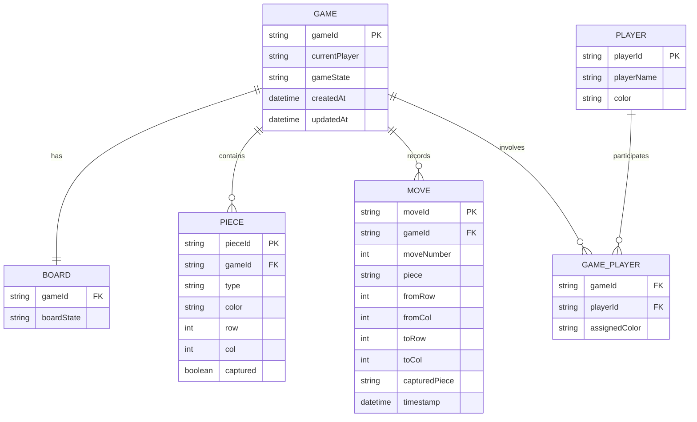

# Chinese Chess Entity Relationship Diagram

## 實體說明

### GAME (遊戲)
- **gameId**: 遊戲唯一標識
- **currentPlayer**: 當前回合的玩家顏色 (RED/BLACK)
- **gameState**: 遊戲狀態 (WAITING/IN_PROGRESS/CHECKMATE/DRAW)
- **createdAt**: 遊戲創建時間
- **updatedAt**: 最後更新時間

### BOARD (棋盤)
- **gameId**: 關聯到遊戲
- **boardState**: 棋盤狀態的序列化表示

### PIECE (棋子)
- **pieceId**: 棋子唯一標識
- **gameId**: 所屬遊戲
- **type**: 棋子類型 (GENERAL/GUARD/ROOK/HORSE/CANNON/ELEPHANT/SOLDIER)
- **color**: 棋子顏色 (RED/BLACK)
- **row**: 當前行位置 (1-10)
- **col**: 當前列位置 (1-9)
- **captured**: 是否已被吃掉

### MOVE (移動記錄)
- **moveId**: 移動記錄唯一標識
- **gameId**: 所屬遊戲
- **moveNumber**: 第幾步
- **piece**: 移動的棋子
- **fromRow/fromCol**: 起始位置
- **toRow/toCol**: 目標位置
- **capturedPiece**: 被吃掉的棋子（如果有）
- **timestamp**: 移動時間

### PLAYER (玩家)
- **playerId**: 玩家唯一標識
- **playerName**: 玩家名稱
- **color**: 玩家喜好顏色

### GAME_PLAYER (遊戲-玩家關聯)
- **gameId**: 遊戲ID
- **playerId**: 玩家ID
- **assignedColor**: 在此局遊戲中分配的顏色

## 關係說明

1. **一對一關係**：
   - 每個遊戲有一個棋盤

2. **一對多關係**：
   - 每個遊戲包含多個棋子
   - 每個遊戲記錄多個移動
   - 每個玩家可以參與多個遊戲

3. **多對多關係**：
   - 遊戲和玩家通過 GAME_PLAYER 關聯表連接